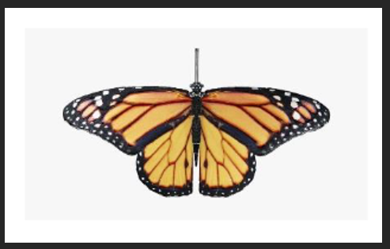
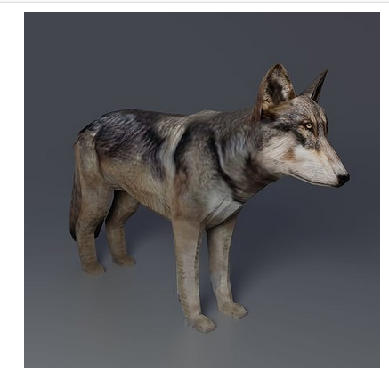
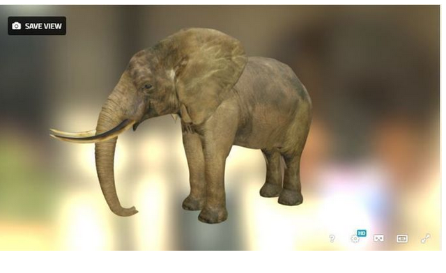
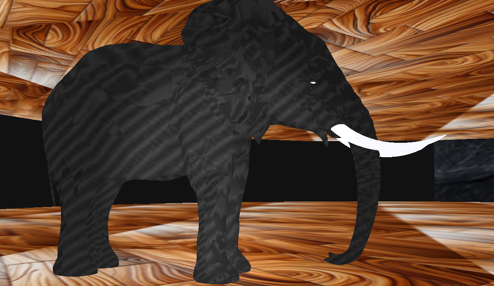

```yaml
Titulo: Manual técnico
Escrito por: Victor Miguel Barrera Peña
Versión: 0.0.7
Fecha: 22/11/2023
```


# Modelos

Los modelos empleados son los siguientes:

## Mariposa



## Lobo

El lobo es más pequeño por ello tiene una escala x4 con respecto a los otros modelos




## Leopardo

Se cambio el leopardo por incompatibilidad con el modelo , y no hay modelos gratis.


## Elefante



Esta en un formato .fbx, asi que tendrás que convertirla a blender con la siguiente página:

https://imagetostl.com/convert/file/fbx/to/blend#google_vignette

Lo malo es que solo te da el modelo, no las texturas, tiene algunos erroes y después de corregirlos, este es el resultado



# Referencias

## Links de modelos

- Mariposa:

https://www.cgtrader.com/free-3d-models/animals/insect/low-poly-butterfly-fully-rigged-

for-blender

- Lobo:

https://www.cgtrader.com/items/3223795/download-page

- Elefante:

https://www.cgtrader.com/free-3d-models/animals/mammal/elephant-59f6d447-7685-
4692-94bb-8a3333dfe0e7